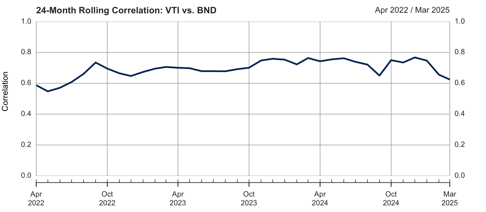

# Multi-Asset Investment Strategy Model

Quantitative portfolio analysis of five Vanguard ETFs (VTI, BND, VEA, VWO, VIG) over April 2020 – April 2025, applying Modern Portfolio Theory, bootstrap inference, and risk decomposition to a post-pandemic, rate-hike-dominated sample.

**→ [Read the full report (PDF)](report.pdf)** &nbsp;|&nbsp; [R Markdown source](report.Rmd)



## Key findings

- **The stock–bond hedge broke down.** The 24-month rolling correlation between VTI (US equities) and BND (US bonds) stayed between **0.5 and 0.8** throughout the sample, driven by the Fed rate-hike cycle. Bonds did not provide their textbook diversification benefit when equities sold off in 2022.
- **Mean-variance optimization rejected naive global diversification.** The tangency portfolio concentrated **~89% in VTI and ~11% in VIG**, effectively zeroing out international (VEA, VWO) and bond (BND) exposure for this period.
- **Capital weights ≠ risk weights.** In an equal-weighted (25% each) equity portfolio, VTI and VEA contributed disproportionate risk relative to their capital allocation, while VWO and VIG contributed less — a concrete illustration of why risk-parity frameworks exist.

## Methodology

Adjusted monthly prices are pulled from Yahoo Finance via `quantmod`, converted to simple returns, and analyzed using mean-variance optimization (`IntroCompFinR`), bootstrap inference for Sharpe ratios and Value-at-Risk (`boot`), and 24-month rolling statistics. All derivations and charts are in [report.pdf](report.pdf).

## Repository structure

```
.
├── report.Rmd                # Full R Markdown source
├── report.pdf                # Compiled report (~30 pages)
├── R/
│   ├── data_loading.R        # Yahoo Finance price fetch
│   ├── portfolio_optimization.R  # Annualization & summary helpers
│   └── risk_metrics.R        # VaR and bootstrap Sharpe functions
├── hero_rolling_corr.png
├── LICENSE
└── README.md
```

## Requirements

R ≥ 4.0 with a working LaTeX distribution (e.g. `tinytex::install_tinytex()`). Install R dependencies with:

```r
install.packages(c(
  "IntroCompFinR", "PerformanceAnalytics", "quantmod", "boot",
  "corrplot", "xtable", "knitr", "lubridate", "tidyverse",
  "gridExtra", "rmarkdown"
))
```

Then render with `rmarkdown::render("report.Rmd")`.

## Author

Zhongqi (Kenny) Ren
